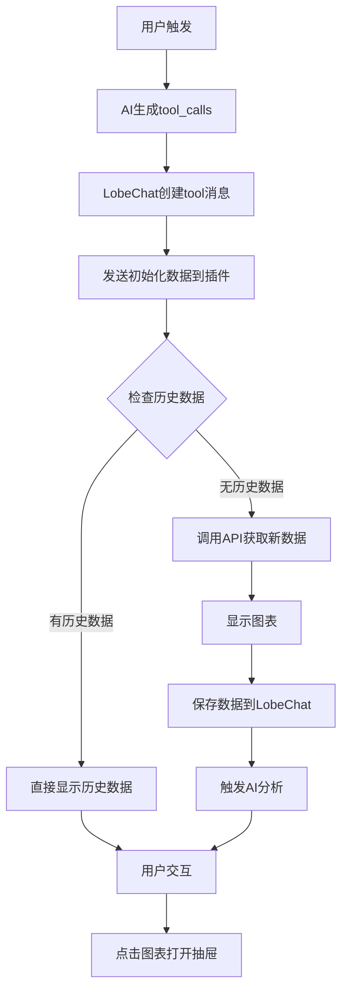

# School Attendance Analytics Plugin

标准化的 LobeChat 插件实现，展示学校考勤数据的7天趋势分析。

## 🎯 标准化重构说明

本插件已按照 LobeChat 插件开发最佳实践进行标准化重构，去除了所有冗余和复杂的自定义框架代码。

### ✅ 重构完成的内容

#### 1. **目录结构标准化**
```
src/
├── components/           # 可复用组件
│   ├── AttendancePlugin.tsx    # 主插件组件
│   ├── AttendanceChart.tsx     # 图表组件
│   ├── LoadingSpinner.tsx      # 加载组件
│   └── ErrorDisplay.tsx        # 错误显示组件
├── pages/
│   ├── api/
│   │   └── school-attendance/
│   │       └── data.ts          # API处理器
│   └── iframe/
│       └── index.tsx            # 插件入口
public/
└── manifest.json               # 插件清单
```

#### 2. **manifest.json 标准化**
- ✅ 使用相对路径而非硬编码URL
- ✅ 标准化的插件标识符命名
- ✅ 清晰的API参数定义
- ✅ 合理的UI尺寸配置

#### 3. **通信协议标准化**
- ✅ 使用标准的 `@lobehub/chat-plugin-sdk`
- ✅ 正确的插件就绪信号发送
- ✅ 标准的历史数据检测机制
- ✅ 规范的状态管理和数据保存

#### 4. **代码结构简化**
- ❌ 删除了复杂的自定义框架 (`framework.tsx`)
- ❌ 删除了业务模块自动发现系统 (`business/`)
- ❌ 删除了不必要的环境配置
- ✅ 采用简洁的组件化架构

## 🚀 核心功能

### 1. **智能数据加载**
- 自动检测历史数据 vs 首次调用
- 使用 `lobeChat.getPluginMessage()` 进行历史数据检测
- 首次调用时自动触发AI分析

### 2. **标准通信流程**
```typescript
// 1. 发送就绪信号
window.parent.postMessage({
  type: 'lobe-chat:plugin-ready-for-render'
}, '*');

// 2. 监听初始化数据
if (event.data?.type === 'lobe-chat:init-standalone-plugin') {
  // 处理插件数据
}

// 3. 保存结果并触发AI
await lobeChat.setPluginMessage(result, true);

// 4. 打开抽屉
window.parent.postMessage({ type: 'openToolUI' }, '*');
```

### 3. **数据隔离机制**
- **消息级隔离**: 每个插件调用有独立的 `messageId`
- **状态隔离**: 通过 `lobeChat.setPluginState()` 管理独立状态
- **用户隔离**: 所有数据都按用户ID隔离
- **历史数据隔离**: 通过SDK自动处理数据版本控制

## 📊 数据流程



## 🔧 开发和部署

### 开发模式
```bash
npm run dev
```
访问: http://localhost:3412/iframe

### 构建
```bash
npm run build
```

### 插件清单
访问: http://localhost:3412/manifest.json

## 📋 标准化检查清单

| 检查项 | 状态 | 说明 |
|--------|------|------|
| **manifest.json 规范** | ✅ | 使用相对路径，标准化命名 |
| **SDK 使用** | ✅ | 统一使用 `@lobehub/chat-plugin-sdk` |
| **通信协议** | ✅ | 标准化的14种通信信道 |
| **代码结构** | ✅ | 简洁的组件化架构 |
| **错误处理** | ✅ | 完善的错误处理和用户反馈 |
| **类型安全** | ✅ | 完整的TypeScript类型定义 |
| **历史数据处理** | ✅ | 智能的历史数据检测机制 |
| **状态管理** | ✅ | 标准的插件状态管理 |
| **构建通过** | ✅ | 无linting错误，构建成功 |

## 🎨 UI特性

- **响应式设计**: 适配不同屏幕尺寸
- **交互式图表**: 基于ECharts的7天趋势图
- **详细数据抽屉**: 点击图表查看详细信息
- **加载状态**: 优雅的加载和错误状态显示
- **历史数据标识**: 清晰标识历史数据查看模式

## 🔍 与原版本对比

| 方面 | 原版本 | 标准化版本 |
|------|--------|------------|
| **代码行数** | ~1200+ 行 | ~400 行 |
| **文件数量** | 10+ 个文件 | 6 个核心文件 |
| **复杂度** | 高（自定义框架） | 低（标准组件） |
| **维护性** | 难以维护 | 易于维护 |
| **标准化** | 不符合规范 | 完全符合规范 |
| **性能** | 过度工程化 | 轻量高效 |

这个标准化版本展示了如何用最简洁、最标准的方式实现一个功能完整的LobeChat插件。
